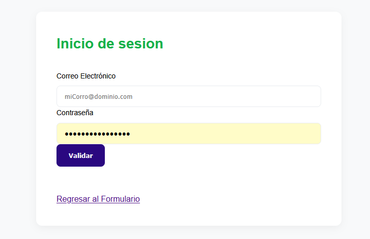
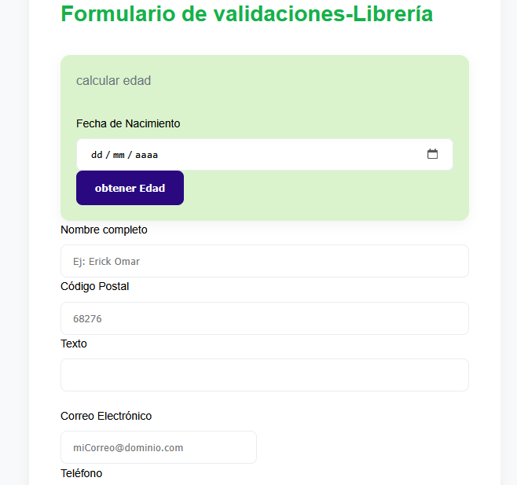
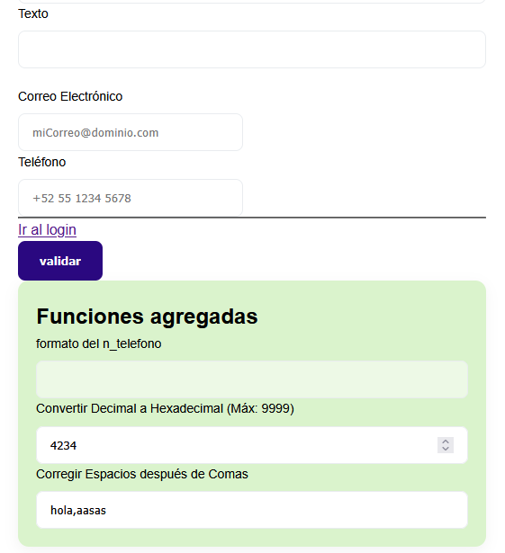
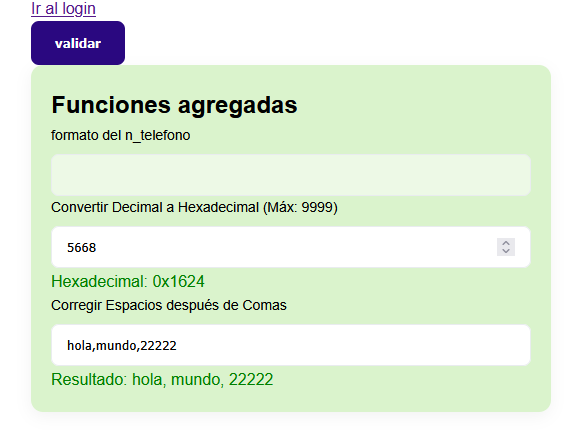

# utileria_erick.js
libreria de javascript

Actividad 2 de la materia Progrmacion web 
Alumno: Santiago Ramirez Erick Omar
Institución: Instituto tecnologico de oaxaca
Carrera: Ingenieria en sistemas computacionales 

/------------------------
esta catividad busca aprender a crear librerias de js, para Una solución ligera en JavaScript nativo diseñada para facilitar la implementacion de validaciones de uso continuo para el ahorro de tiempo y codigo en formularios web 

validaciones de componentes
Longitud de números
Nombres. -- medinate la funcion para saber si solo hay letras 
estructura de correos electrónicos.
Fechas de nacimiento. 
el calculo de la edad por la fecha de nacimiento ingresada
Contraseñas de 8 caracteres, con restricciones 
Números telefónicos.

Módulo de Acceso (Login)
Vista del formulario base para el control de sesiones enlazado al proyecto:

Interfaz del Formulario - Parte 1
Visualización de los módulos superiores de cálculo de edad y datos básicos:

Interfaz del Formulario - Parte 2
Visualización de la sección de correo, teléfono y las nuevas utilerías añadidas: 

Instalación y Configuración

Para integrar las validaciones en tu proyecto, puedes copiar el archvo utileriajs que se encuentra en la carpeta js y hacer referencia del archivo en el pie de tu documento HTML antes del cierre de la etiqueta `</body>`:

html
<!-- 1. Cargar primero la librería de utilerías puras -->

<!-- 2. Cargar el script que gestiona la lógica de tu formulario -->

en el js login y formularios se implemento el funcionamiento de la libreria mandando a llamar a las funciones y dependiendo de lo que retornan pasar una repsuesta para los imputs del html 

Ejemplo del uso de Conversión de Decimal a Hexadecimal 

Permite transformar valores numéricos enteros a su representación base 16 en mayúsculas, ideal para sistemas de codificación o identificación visual rápida.

function decimalAHexadecimal(num) {
    let n = parseInt(num, 10);
    if (isNaN(n) || n >= 10000 || n < 0) {
        return null; 
    }
    return n.toString(16).toUpperCase();
}

Implementación en Formulario (formulario.js):
let numeroDecimal = document.getElementById("numeroDecimal").value;
let resultadoHex = decimalAHexadecimal(numeroDecimal);

if (resultadoHex !== null) {
    document.getElementById("mensajeHexadecimal").textContent = "Hexadecimal: 0x" + resultadoHex;
    document.getElementById("mensajeHexadecimal").style.color = "green";
} else {
    document.getElementById("mensajeHexadecimal").textContent = "Número inválido (Debe ser menor a 10000 y positivo)";
    document.getElementById("mensajeHexadecimal").style.color = "red";
}

2. Corrección Gramatical de Espacios tras Comas

Detecta patrones donde el usuario escribe texto corrido separado por comas (ej. listas o etiquetas) y añade de forma automática el espacio reglamentario.

    Función Core (utileria.js):
    JavaScript

    function corregirEspaciosComas(texto) {
        return texto.replace(/,([a-zA-ZÁÉÍÓÚáéíóúÑñ0-9])/g, ', $1');
    }

    Implementación en Formulario (formulario.js):

let textoComas = document.getElementById("textoComas").value;
let textoCorregido = corregirEspaciosComas(textoComas);

document.getElementById("mensajeComas").textContent = "Resultado: " + textoCorregido;
document.getElementById("textoComas").value = textoCorregido; // Actualización en tiempo real

